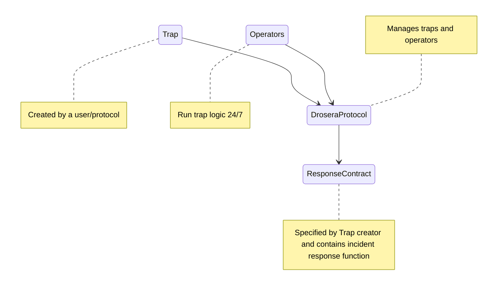

# Table of Contents

- [Drosera Trap Examples](#drosera-trap-examples)
  - [High Level Overview](#high-level-overview)
  - [Trap Simulation](#trap-simulation)
  - [What is possible with Traps?](#what-is-possible-with-traps)
    - [Detection of Incidents](#detection-of-incidents)
    - [Incident Response](#incident-response)
  - [How Can I Collaborate/Contribute?](#how-can-i-collaboratecontribute)
    - [Cool Ideas](#cool-ideas)

# Drosera Trap Examples

This repository contains examples of [Drosera Traps](https://dev.drosera.io/) to be used as reference. Some traps are examples of how to protect certain types of protocols as well as traps that have been applied to previous exploits.

## High Level Overview

The provided examples in this repository show how a trap can be structured to detect an incident using solidity. A trap simply indicates that an incident has occured via the `boolean` result from the Trap's `shouldRespond` function.

- If shouldRespond returns `true` then there is an incident.
- If shouldRespond returns `false` then there are no incidents.

In order to provide additional context, its important understand how Drosera Traps are connected to the Drosera Protocol. The exact implementation details of the Drosera Protocol are not required to experiment with Trap creation.

Refer to [Trap Anatomy](https://dev.drosera.io/docs/traps/create-trap#trap-anatomy) for in-depth details of Trap architecture.

## Trap Simulation

Drosera node operators run Trap logic every block using an array of previous `collect` data.

You can visualize this as the `shouldRespond` function being called with data from previous blocks.

This allows for:

- 🚀 Easy trap logic simulation in a local dev environment.
  - Leveraging foundry
- ⚡ Quick testing of trap logic with different data sets.
  - Running against mainnet/testnet forks
- 🐸 Leveraging ethereum natively
  - Solidity

Example:
A trap collects the balance of a user every block. The `shouldRespond` function checks if the user's balance has decreased by 10% in the last block. `shouldRespond` expects an array of balances from the last 2 blocks.

        | block 1 | block 2 | block 3 | block 4 |
        |---------|---------|---------|---------|
        |   200   |   300   |   400   |   200   |
        |   -     |    ✅    |   ✅    |   ❌    |

    "-" indicates that the trap does not have enough data to check for an incident.

    "✅" indicates that the trap has not detected an incident.

    "❌" indicates that the trap has detected an incident.

## What is possible with Traps?

As Drosera continues to grow, the team and developer community will collaborate on new logic, contracts, scripts, and libraries to be used in tandem with Drosera Traps. Expertise in Trap creation and Drosera automation will emerge as a new specialization where the community can come together to create new technologies enabled by Drosera.

### Detection of Incidents

Drosera Trap's enable time-series analysis with on-chain data. This means historical data can be collected and analyzed using a smart contract.

| Analysis Type                                    | Description                                                                                                                                                                                                                  |
| ------------------------------------------------ | ---------------------------------------------------------------------------------------------------------------------------------------------------------------------------------------------------------------------------- |
| **Rate Of Change Analysis**                      | X% change in a value or values over Y blocks                                                                                                                                                                                 |
| **Moving Average Analysis**                      | X% change from the running moving average                                                                                                                                                                                    |
| **Frequency Analysis**                           | Detect # of blocks a counter was above or below a threshold   Detect if value was maintained, below, or above threshold over X continuous blocks                                                                          |
| **Pattern Analysis**                             | Detect x=a (time 1) then x=b (time 2) then x=a (time 3)   Detect x=a when y=b                                                                                                                                             |
| **Conditional Analysis**                         | Detect if x=a then detect A and execute B, elseif x=b then detect C and execute D   While x=a detect A and execute B                                                                                                      |
| **Exponential Smoothing Analysis**               | Give more weight to recent observations, helps to see anomalies                                                                                                                                                              |
| **Adjustable Threshold Rate Of Change Analysis** | Instead of fixed X%, you can adjust thresholds                                                                                                                                                                               |
| **Anomaly Detection Analysis**                   | If a value is far from median it might be an anomaly                                                                                                                                                                         |
| **Transaction Frequency Analysis**               | Could be tracked if contract has data points that track it                                                                                                                                                                   |
| **Oracle Data Analysis**                         | Using oracle data sources (chainlink, etc) to detect scenarios                                                                                                                                                               |
| **Protocol-Specific Data Analysis**              | Tracking vesting schedules (analysis on accounts holding)   Prominent account tracking   Liquidity analysis   Tracking debt-to-collateral ratio of accounts   Economic analysis   Address reputation tracking |

### Incident Response

This example repo currently doesnt cover examples/simulation of incident response, but it is important to note that the Drosera Protocol allows the user to specify a contract and a function to be called by the node operators when an incident is detected.

The incident response functionality can be used for any smart contract function:

- Pausable Functionality
- Transferring funds
- Swapping funds
- Upgrade Reverting
- Message Bridging
- Alerting
- Off-chain systems pick up the on-chain alert and perform tasks:
  - Zapier
  - The Graph
  - Etc
- Blacklisting accounts
- Action Routing
- Action can be conditional based on configurations defined by the protocol
- Chainlink function calls
- Calling functionality on other protocols

## How Can I Collaborate/Contribute?

The best way to collaborate is to create new examples of traps that can be used as reference for the community. The Drosera team will review and provide feedback on the examples.

The idea here is that a robust library of trap examples, logic, scripts, and tools will help anyone that wants to leverage key data selectors from a vast ocean of protocols. A developer may want to have a trap that leverages oracles, restaking, bridges, dexs, etc. The possibilities are endless.

The process for contributing is as follows:

- Fork this repository
- Create a new branch
- Add your trap example
- Create a pull request

### Cool Ideas

- Create a Trap that performs:
  - Analysis of oracle price data
  - AVS slashing detection
  - Restaking economic analysis
  - Bridge monitoring
  - Dex liquidity analysis
- Create a Library for:
  - Time series analysis
  - Pattern matching
  - Aggregating popular DEX data
  - Aggregating popular Lending data
- Create a Script for:
  - Running operator simulation (forge script on loop)
